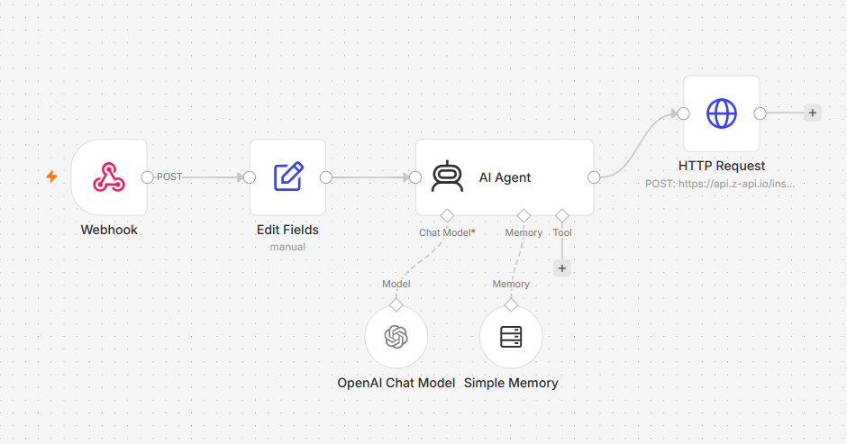

# Fluxo n8n: Agente AI de Atendimento via Z-API

Este fluxo recebe requisições via Webhook, processa os dados de entrada, consulta um Agente de IA com memória e envia a resposta de volta utilizando a Z-API (WhatsApp).

## 📌 Visão Geral do Fluxo

1. **Webhook (POST):** Ponto de entrada que recebe as mensagens enviadas pela aplicação externa.
2. **Edit Fields (manual):** Formata, limpa ou estrutura os campos recebidos antes do envio para o agente.
3. **AI Agent:** Núcleo de decisão do fluxo.
   - **Chat Model:** OpenAI Chat Model (responsável pela inteligência e respostas).
   - **Memory:** Simple Memory (mantém o contexto da conversa do usuário).
4. **HTTP Request:** Dispara a resposta final via requisição POST para a API da Z-API (`https://api.z-api.io/ins...`).

## 🚀 Como Importar e Usar

1. Baixe o arquivo `workflows/chat-bot-zapi.json` deste repositório.
2. No seu painel do n8n, vá em **Workflows** > **Import from File** e selecione o JSON.
3. Configure as seguintes credenciais no seu n8n:
   - **OpenAI API Key** (para o nó `OpenAI Chat Model`)
   - **Z-API Credentials / Token** (para o nó `HTTP Request`)
4. Ative o nó **Webhook** e substitua a URL de teste pela URL de Produção no sistema de origem.
